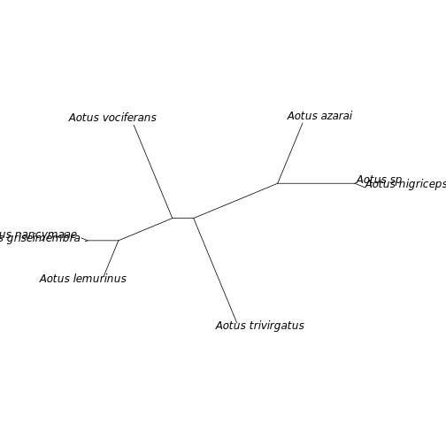

# Introduction

The first step to running a phylogenetic analysis is the identification of overlapping sequences. Often orthology is determined by pairing sequences whose gene names match (e.g. COI sequences with COI sequences, rbcl sequences with rbcl sequences). Problems can arise however if gene names differ between authors, if different gene sections are represented or if sequences are mislabelled. These issues can be especially problematic for large-scale analyses where individual errors cannot be detected.

[PhyLoTa](https://pubmed.ncbi.nlm.nih.gov/18570030/) is a pipeline that uses an alignment search tool to identify orthologous sequences without the need for gene name matching. For a given parental taxonomic group, the pipeline will search through available sequences hosted on GenBank and identify orthologous sequence clusters. A user is then able to survey the identified clusters and select the ones which best suit their phylogenetic analysis needs, e.g. by selecting the clusters that maximise the number of taxonomic groups.

This R pacakge, `phylotaR`, is an R implementation of this pipeline. In this vignette we will demonstrate how to run PhyLoTa using a small taxonomic group. The pipeline is composed of four automated stages (taxise, download, cluster, cluster2) and a final user-performed stage of cluster selection.


# Installing NCBI BLAST+ Tools

The PhyLoTa pipeline uses BLAST to identify orthologous sequence clusters. In order to run phylotaR, a local copy of the BLAST software must be installed on your computer. **Installing the phylotaR package does not install BLAST, it must be installed separately**. To install BLAST+, please see the NCBI website's [installation instructions](https://www.ncbi.nlm.nih.gov/books/NBK279671/).

# Pipeline


## Setup

For demonstration purposes we will run the pipeline on a small taxonomic group. Because they are charismatic and relatively well-studied, we will select the Night Monkey genus, [Aotus](https://www.ncbi.nlm.nih.gov/Taxonomy/Browser/wwwtax.cgi?mode=Info&id=9504). Now that we have decided on a taxonomic group we need to find out its unique taxonomic ID. This can be looked up by navigating to the [NCBI taxonomy webpage](https://www.ncbi.nlm.nih.gov/taxonomy) and searching 'Aotus'. Doing this, we can see that Aotus ID is **9504**. We will need this number for specifying the parameters in our pipeline. (Notice, that there is also a plant genus called Aotus.)

To begin a run, we will need to create a new folder that will contain all the output files generated by the `phylotaR` pipeline. Since we are running the analysis on the Aotus genus, let's call the folder `aotus/`. Now we have our working directory folder created, we can now open R and run the following code.


```r
library(phylotaR)
wd <- '[YOUR PATH TO AOTUS FOLDER]'
ncbi_dr <- '[YOUR PATH TO NCBI BLAST TOOLS]'
```


```r
txid <- 9504
setup(wd = wd, txid = txid, ncbi_dr = ncbi_dr, v = TRUE)
```

```
## -----------------------------------------------------
## phylotaR: Implementation of PhyLoTa in R [v1.2.0.999]
## -----------------------------------------------------
## Checking for valid NCBI BLAST+ Tools ...
## Found: [/workspaces/blast/bin/makeblastdb]
## Found: [/workspaces/blast/bin/blastn]
## . . Running makeblastdb
## Setting up pipeline with the following parameters:
## . blstn          [/workspaces/blast/bin/blastn]
## . btchsz         [100]
## . date           [2022-07-12]
## . db_only        [FALSE]
## . mdlthrs        [3000]
## . mkblstdb       [/workspaces/blast/bin/makeblastdb]
## . mncvrg         [51]
## . mnsql          [250]
## . multiple_ids   [FALSE]
## . mxevl          [1e-10]
## . mxnds          [1e+05]
## . mxrtry         [100]
## . mxsql          [2000]
## . mxsqs          [50000]
## . ncps           [1]
## . outfmt         [6 qseqid sseqid pident length evalue qcovs qcovhsp]
## . outsider       [FALSE]
## . srch_trm       [NOT predicted[TI] NOT "whole genome shotgun"[TI] NOT unverified[TI] NOT "synthetic construct"[Organism] NOT refseq[filter] NOT TSA[Keyword]]
## . txid           [9504]
## . v              [TRUE]
## . wd             [/tmp/RtmpDeuk8B]
## . wt_tms         [1, 3, 6 ...]
## -----------------------------------------------------
```

The above imports the `phylotaR` package and initiates a cache that will contain the pipeline parameters. For this tutorial we will keep the parameters as their default. See the function `parameters()` for a complete list and description of all the parameters and their default values. For more detailed information on the parameters please see the publication, [phylotaR: An Automated Pipeline for Retrieving Orthologous DNA Sequences from GenBank in R](https://doi.org/10.3390/life8020020). `wd` must be a file path to the folder we called `aotus/`. `ncbi_dr` must be a file path to the folder containing all the NCBI BLAST+ tools -- see above 'Installing NCBI BLAST+ Tools'. Depending on your system and how you installed the tools, they may be in your system path in which case you can simply supply '.' to the `ncbi_dr` argument. On my computer I provide the path to the where the `blastn` executable is located, e.g. `/usr/local/ncbi/blast/bin/`. Running `setup()` will verify whether the BLAST tools are installed correctly.

## Running

After `setup()` has been run we can run the pipeline with the following command.


```r
run(wd = wd)
```

```
## ---------------------------------------------------
## Running pipeline on [unix] at [2022-07-12 13:55:01]
## ---------------------------------------------------
## Running stages: taxise, download, cluster, cluster2
## --------------------------------------------
## Starting stage TAXISE: [2022-07-12 13:55:01]
## --------------------------------------------
## Searching taxonomic IDs ...
## Downloading taxonomic records ...
## . [1-22]
## Generating taxonomic dictionary ...
## ---------------------------------------------
## Completed stage TAXISE: [2022-07-12 13:55:06]
## ---------------------------------------------
## ----------------------------------------------
## Starting stage DOWNLOAD: [2022-07-12 13:55:06]
## ----------------------------------------------
## Identifying suitable clades ...
## Identified [1] suitable clades.
## Downloading hierarchically ...
## Working on parent [id 9504]: [1/1] ...
## . + direct ...
## . + by child ...
## . . Working on child [id 2688256]
## . . + whole subtree ...
## . . . Downloading [34 sqs] ...
## . . . . [1-34]
## . . . Working on child [id 1263727]
## . . . + whole subtree ...
## . . . . Downloading [3 sqs] ...
## . . . . . [1-3]
## . . . . Working on child [id 361674]
## . . . . + whole subtree ...
## . . . . . Downloading [1 sqs] ...
## . . . . . . [1-1]
## . . . . . Working on child [id 292213]
## . . . . . + whole subtree ...
## . . . . . . Downloading [100 sqs] ...
## . . . . . . . [1-100]
## . . . . . . Working on child [id 57176]
## . . . . . . + whole subtree ...
## . . . . . . . Downloading [200 sqs] ...
## . . . . . . . . [1-100]
## . . . . . . . . [101-200]
## . . . . . . . Working on child [id 57175]
## . . . . . . . + whole subtree ...
## . . . . . . . . Downloading [100 sqs] ...
## . . . . . . . . . [1-100]
## . . . . . . . . Working on child [id 43147]
## . . . . . . . . + whole subtree ...
## . . . . . . . . . Downloading [900 sqs] ...
## . . . . . . . . . . [1-100]
## . . . . . . . . . . [101-200]
## . . . . . . . . . . [201-300]
## . . . . . . . . . . [301-400]
## . . . . . . . . . . [401-500]
## . . . . . . . . . . [501-600]
## . . . . . . . . . . [601-700]
## . . . . . . . . . . [701-800]
## . . . . . . . . . . [801-900]
## . . . . . . . . . Working on child [id 37293]
## . . . . . . . . . + whole subtree ...
## . . . . . . . . . . Downloading [600 sqs] ...
## . . . . . . . . . . . [1-100]
## . . . . . . . . . . . [101-200]
## . . . . . . . . . . . [201-300]
## . . . . . . . . . . . [301-400]
## . . . . . . . . . . . [401-500]
## . . . . . . . . . . . [501-600]
## . . . . . . . . . . Working on child [id 30591]
## . . . . . . . . . . + whole subtree ...
## . . . . . . . . . . . Downloading [1000 sqs] ...
## . . . . . . . . . . . . [1-100]
## . . . . . . . . . . . . [101-200]
## . . . . . . . . . . . . [201-300]
## . . . . . . . . . . . . [301-400]
## . . . . . . . . . . . . [401-500]
## . . . . . . . . . . . . [501-600]
## . . . . . . . . . . . . [601-700]
## . . . . . . . . . . . . [701-800]
## . . . . . . . . . . . . [801-900]
## . . . . . . . . . . . . [901-1000]
## . . . . . . . . . . . Working on child [id 9505]
## . . . . . . . . . . . + whole subtree ...
## . . . . . . . . . . . . Downloading [300 sqs] ...
## . . . . . . . . . . . . . [1-100]
## . . . . . . . . . . . . . [101-200]
## . . . . . . . . . . . . . [201-300]
## Successfully retrieved [3238 sqs] in total.
## -----------------------------------------------
## Completed stage DOWNLOAD: [2022-07-12 13:57:42]
## -----------------------------------------------
## ---------------------------------------------
## Starting stage CLUSTER: [2022-07-12 13:57:42]
## ---------------------------------------------
## Working from [id 9504] down hierarchy
## . + direct [id 9504 (genus)]
## . + subtree [id 9504 (genus)]
## . . BLASTing [3238 sqs] ....
## . . Running makeblastdb
## . . Running blastn
## . . Removed [85435/180447] hits due to insufficient coverage
## . . Identified [797] clusters
## . + parent [id 9504]
## . . + direct [id 2688256 (no rank)]
## . . + subtree [id 2688256 (no rank)]
## . . . BLASTing [34 sqs] ....
## . . . Removed [0/417] hits due to insufficient coverage
## . . . Identified [15] clusters
## . . + parent [id 2688256]
## . . . + subtree [id 1230482 (species)]
## . . + parent [id 2688256]
## . . . + subtree [id 1090913 (species)]
## . . + parent [id 2688256]
## . . . + subtree [id 1002694 (species)]
## . . + parent [id 2688256]
## . . . + subtree [id 940829 (species)]
## . . + parent [id 2688256]
## . . . + subtree [id 413234 (species)]
## . . + parent [id 2688256]
## . . . + subtree [id 261316 (species)]
## . . + parent [id 2688256]
## . . . + subtree [id 231953 (species)]
## . . + parent [id 2688256]
## . . . + subtree [id 222417 (species)]
## . + parent [id 9504]
## . . + subtree [id 1263727 (species)]
## . + parent [id 9504]
## . . + subtree [id 361674 (species)]
## . + parent [id 9504]
## . . + subtree [id 292213 (species)]
## . + parent [id 9504]
## . . + subtree [id 57176 (species)]
## . + parent [id 9504]
## . . + subtree [id 57175 (species)]
## . + parent [id 9504]
## . . + subtree [id 43147 (species)]
## . + parent [id 9504]
## . . + subtree [id 37293 (species)]
## . + parent [id 9504]
## . . + direct [id 30591 (species)]
## . . . BLASTing [565 sqs] ....
## . . . Removed [36184/51565] hits due to insufficient coverage
## . . . Identified [266] clusters
## . . + subtree [id 30591 (species)]
## . . . BLASTing [435 sqs] ....
## . . . Removed [911/7414] hits due to insufficient coverage
## . . . Identified [71] clusters
## . . + parent [id 30591]
## . . . + subtree [id 867331 (subspecies)]
## . . + parent [id 30591]
## . . . + subtree [id 280755 (subspecies)]
## . . + parent [id 30591]
## . . . + subtree [id 120088 (subspecies)]
## . + parent [id 9504]
## . . + subtree [id 9505 (species)]
## [1/1]
## ----------------------------------------------
## Completed stage CLUSTER: [2022-07-12 13:57:58]
## ----------------------------------------------
## -----------------------------------------------
## Starting stage CLUSTER^2: [2022-07-12 13:57:58]
## -----------------------------------------------
## Loading clusters ...
## Done. Only one cluster set -- skipping cluster^2
## Dropping all clusters of < 3 sqs ...
## Renumbering clusters ...
## Saving ...
## ------------------------------------------------
## Completed stage CLUSTER^2: [2022-07-12 13:57:59]
## ------------------------------------------------
## -------------------------------------------
## Completed pipeline at [2022-07-12 13:57:59]
## -------------------------------------------
```

This will run all the automated stages of the pipeline: taxise, download, cluster and cluster2. The first of these stages looks up all the taxonomic information available on the descendants of the parent ID provided, `txid`. The second downloads representative sequences for all identified descendants. No additional arguments are required other than `wd` which specifies the working directory that contains the cache and all parameters as set up by `setup()`. In this folder you will also find a `log.txt` that reports detailed information on the progression of the pipeline as well as all the output files generated by each stage. Additionally, you will see session info and a blast version text files. These files, along with the log, can help debugging if any errors occur. The whole pipeline can complete in around 2 minutes for Aotus using default parameters. Aotus, however, is a genus of only 13 taxa, larger clades will take much longer particularly during the download stage.

## Restarting

The pipeline can be halted and restarted. The cache records all downloaded and generated data by the pipeline. If there is a system crash or the user wishes to halt the program, the pipeline can be restarted from the same point it stopped with the function `restart()`. Additionally, due to the potential random nature of the pipeline, a user may wish to re-run the pipeline from certain stages. This can be achived by first using `reset()` followed by `restart()`. For example, in the code below a completed pipeline is reset to 'cluster' and then restarted. After running these commands, the pipeline will run as if it has only just completed the download stage. Note, all resets and restarts are recorded in the log.


```r
reset(wd = wd, stage = 'cluster')
restart(wd = wd)
```

### Changing parameters

Paramaters can always be set by a user at the initiation of a folder with the `setup()` function. To change the parameter values after a folder has already been set up, a user can use `parameters_reset()`. For example, if the download stage is taking particularly long, the `btchsz` could be increased. This would raise the number of sequences downloaded per request. (Note, too high a `btchsz` may cause your NCBI Entrez access being limited.)


```r
# use ctrl+c or Esc to halt R
# increase the btchsz from the default to 300
parameters_reset(wd = wd, parameters = 'btchz', values = 300)
restart(wd = wd)
# ^ restart from whatever point it was halted
```

## Cluster selection

After a pipeline has completed, the identified clusters can be interrogated. We can generate a phylota object using `read_phylota()` but in the code below we will load a pre-existing phylota object from the package data. The phylota object contains cluster, sequence and taxonomic information on all the clusters. It has 6 data slots: cids, sids, txids, txdct, sqs, clstrs, prnt_id and prnt_nm. Each of these slots can be accessed with `@`, see ?\`Phylota-class\` for more information. The `phylotaR` package has a range of functions for probing clusters in a phylota object. For example, if we want to know how many different taxonomic groups are represented by each cluster we can use `get_ntaxa()`.


```r
library(phylotaR)
# pre-load already run aotus from package data
data('aotus')
all_clusters <- aotus
print(all_clusters)
```

```
## [1] "Phylota Table (Aotus)\n- [193] clusters\n- [1499] sequences\n- [13] source taxa\n"
```

```r
# otherwise, run:
# all_clusters <- read_phylota(wd)
cids <- all_clusters@cids
n_taxa <- get_ntaxa(phylota = all_clusters, cid = cids)
```

We can then drop all the clusters with fewer than 6 taxa and create a new phylota object using the `drop_cls()` function. Let's then take a peak of the now smaller object's clusters using `summary()`.


```r
keep <- cids[n_taxa > 6]
selected <- drop_clstrs(phylota = all_clusters, cid = keep)
smmry <- summary(selected)
print(smmry)
```

```
##   ID    Type                Seed Parent N_taxa N_seqs Med_sql       MAD                      Definition
## 1  4 subtree            U36844.1   9504      9     41     549 0.8397112 gene (0.1), mitochondrial (0.1)
## 2  9 subtree          AJ489745.1   9504     10     29    1140 1.0000000   aotus (0.1), cytochrome (0.1)
## 3 29 subtree AF338374.1/177..829   9504      8     10     653 0.9658499          sry (0.2), aotus (0.1)
##                        Feature
## 1                     coii (1)
## 2 cytb (0.4), cytochrome (0.3)
## 3                      sry (1)
```

This summary provides information on each cluster in the phylota object, such as median sequence length, MAD score (the mean alignment density, values closer to 1 indicate all the sequences are of a similar length), most common words in the sequence descriptions and feature names. Let's select the second ID in this table for further investigation. We can extract its cluster and sequences records in the following way.


```r
cid <- smmry[2, 'ID']
# get the cluster record
cluster_record <- selected@clstrs[[cid]]
# use the seq. IDs to get the sequence records
seq_records <- selected@sqs[cluster_record@sids]
# extract a single record
seq_record <- seq_records[[seq_records@ids[[1]]]]
summary(seq_record)
```

```
## SeqRec [ID: AJ489745.1]
```

```r
# get the sequence
seq <- rawToChar(seq_record@sq)
print(substr(x = seq, start = 1, stop = 80))
```

```
## [1] "atgacttctccccgcaaaacacacccactaacaaagatcattaacgaatcattcattgatctacccacaccacccaacat"
```

We could extract and write out each of the sequences for a cluster in the above manner. Handily, however, `phylotaR` comes with some tools to make outputting sequences easier. First because there are multiple sequences per taxon, we need to select a single representative sequence. We can do this with the `drop_by_rank()` function. With this function we choose a taxonomic rank at which we would like our sequences to be represented. The function then chooses the 'best' sequence representing each taxon for that rank using a range of criteria. With this new phylota object, we can then extract the scientific names and write out the sequences.


```r
# choose best sequence per species
reduced <- drop_by_rank(phylota = selected, rnk = 'species', n = 1)
# get txids at the species level for each sequence
txids <- get_txids(phylota = reduced, cid = cid, rnk = 'species')
# look up name for txids
scientific_names <- get_tx_slot(phylota = reduced, txid = txids, slt_nm = 'scnm')
# clean the names
scientific_names <- gsub('\\.', '', scientific_names)
scientific_names <- gsub('\\s+', '_', scientific_names)
print(scientific_names)
```

```
##           AJ489745.1           DQ098865.1           DQ098869.1           DQ098873.1           HQ005497.1           HQ005502.1 
##    "Aotus_nancymaae"       "Aotus_azarai" "Aotus_griseimembra"  "Aotus_trivirgatus"    "Aotus_nigriceps"   "Aotus_vociferans" 
##           HQ005506.1   KR528418.1/1..1140 
##    "Aotus_lemurinus"           "Aotus_sp"
```

```r
# look up sequence IDs for our chosen cluster
sids <- reduced@clstrs[[cid]]@sids
# write out
write_sqs(phylota = reduced, sid = sids, sq_nm = scientific_names,
          outfile = file.path(tempdir(), 'cytb.fasta'))
# ^ to avoid clutter, we're writing to a temporary folder
```

## Testing output

We can sanity check our cluster sequences by running a very quick phylogenetic analysis using mafft and raxml. The below code will use the cluster to generate an alignment and a tree through R. In order for the code to run, it requires the installation of mafft and raxml and, additionally, may require tweaking to work on your system.


```r
library(ape)
cwd <- getwd()
setwd(tempdir())
# https://mafft.cbrc.jp/alignment/software/linux.html
# https://github.com/stamatak/standard-RAxML
system('mafft --auto cytb.fasta > alignment.fasta')
system(paste0('raxmlHPC -m GTRGAMMA -f a -N 10 -p 1234 -x 1234 -n aotus -s alignment.fasta'))
tree <- read.tree(file = 'RAxML_bestTree.aotus')
plot(tree, no.margin = TRUE, type = 'unrooted')
```



```r
setwd(cwd)
```
